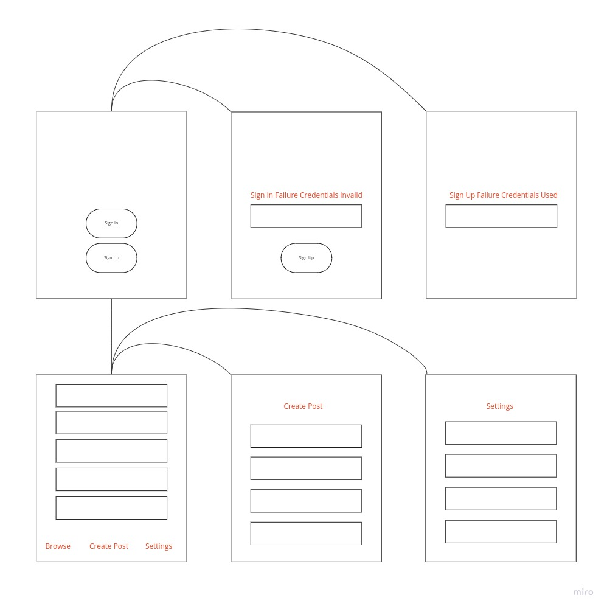
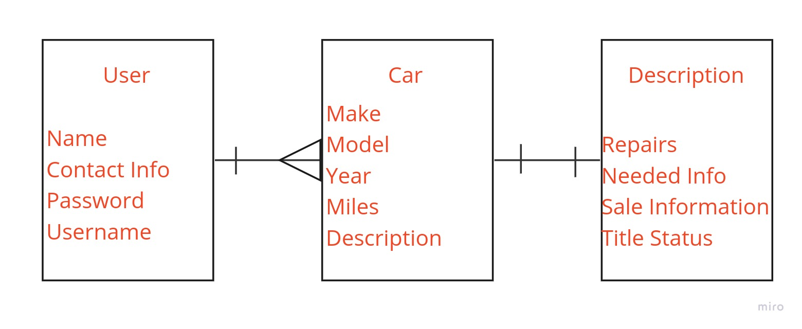

# Mitchy's Used Cars 

## Goal

> To have a internally generating app where a User can go to reliably sell their used cars.

## Wire Frame

## E.R.D.(Entity Relationship Diagram )

## MVP

1. As a user I would like to sign up for Mitchys Used Cars app
2. As a user I would like to be able to sign in to Mitchys Used Cars
3. As a user I would like to browse all the used cars 

## User Story V2

1. As a user I would like to add images of used cars for verification 
2. As a user I would like to change my account password for protection
3. As a user I would like to add updated my car as sold or reduced price 

## User Story V3 
 1. As a user I would like to have a fully Intergrated chat system
 2. As a user I would like to sort what Im browsing by location 
 3. As a user I would like to filter what i browse by price and other identifiers

